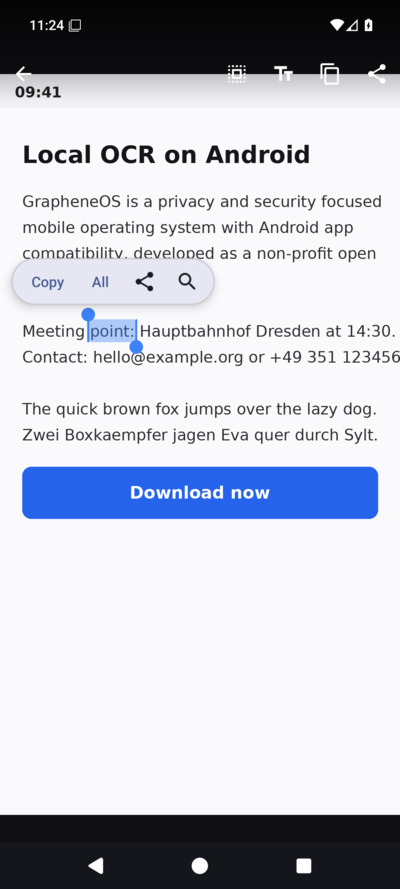
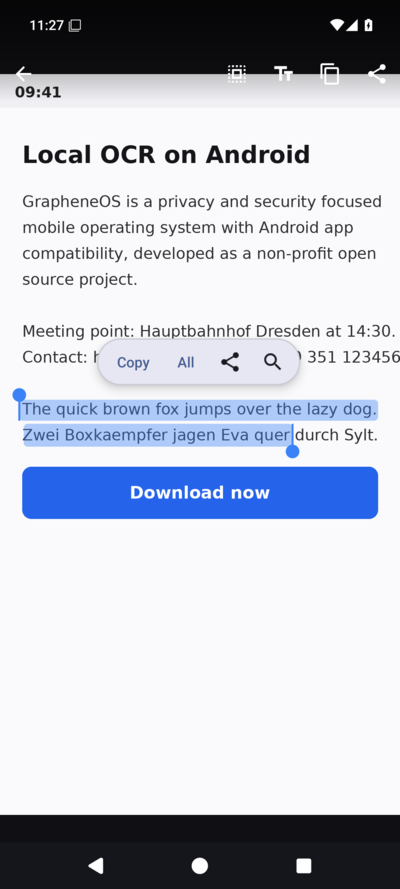
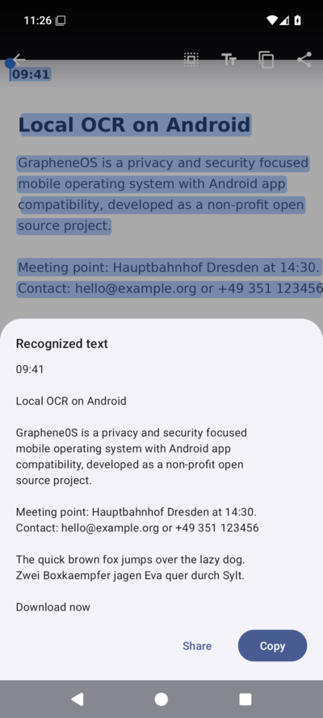

# TextGrab

[](https://github.com/notune/TextGrab/releases/latest)
[](https://apps.obtainium.page/redirect?r=obtainium://add/https%3A%2F%2Fgithub.com%2Fnotune%2FTextGrab)

Select and copy text from any image on de-googled Android (GrapheneOS,
CalyxOS, LineageOS, ...). Works like iOS Live Text or the text selection on
Pixel phones, but fully local and without Google Play services.

## How to use

**Main workflow, from anything on your screen to copied text in seconds:**

1. Swipe down and tap the **OCR screenshot** tile
2. Tap or drag over the text, then copy

One-time setup: open quick settings, tap the edit (pencil) button and drag
the **OCR screenshot** tile into your tiles. Then enable instant capture via
the button on the app's home screen, so the tile can take the screenshot by
itself (Android 12+, uses a screenshot-only accessibility service that reads
no screen content). Without instant capture, take a screenshot first and the
tile opens it.

**Second workflow, for existing images:**

Share any image from any app (gallery, browser, messenger) to **TextGrab**
and the text is selectable. Opening image files with TextGrab from a file
manager works too, as does picking an image from the app's home screen.

## Screenshots

| Tap a word | Long-press and drag | Full text view |
|---|---|---|
|  |  |  |

## How it works

The app bundles Google's ML Kit **on-device** text recognizer, the same class
of neural model that powers Pixel Live Text. The model is packaged inside the
APK, so recognition:

- runs entirely on the device. The app has **no internet permission**.
- needs **no Google Play services** and works on GrapheneOS out of the box.
- is fast: typically well under a second per screenshot on real hardware.

## Supported languages

All Latin-script languages, including:

English, German, French, Spanish, Italian, Portuguese, Dutch, Polish, Czech,
Danish, Swedish, Norwegian, Finnish, Hungarian, Romanian, Turkish, Croatian,
Slovak, Slovenian, Estonian, Latvian, Lithuanian, Albanian, Catalan, Basque,
Galician, Icelandic, Irish, Maltese, Swahili, Tagalog, Vietnamese (partial,
some diacritics may be missed) and more, plus digits and common punctuation.

Chinese, Japanese, Korean and Devanagari need separate ML Kit model packs
(roughly 20 MB each). They are not included yet but are easy to add. Open an
issue if you want one of them.

## Building

```sh
./gradlew assembleRelease
```

Output: `app/build/outputs/apk/release/app-release.apk`.

To build a signed release, create a keystore and put its credentials in
`keystore/keystore.properties` (this directory is gitignored):

```properties
storeFile=keystore/your-release.jks
storePassword=...
keyAlias=...
keyPassword=...
```

Without that file the release build is unsigned. Keep your keystore safe:
updates must be signed with the same key.

## Installing with Obtainium

Tap the Obtainium badge above on your phone (or add
`https://github.com/notune/TextGrab` as an app source in
[Obtainium](https://github.com/ImranR98/Obtainium)) to install TextGrab and
get updates straight from this repo's releases.

## Verifying the APK

Release APKs are signed with this certificate (package + SHA-256, ready to
paste into [AppVerifier](https://github.com/soupslurpr/AppVerifier)):

```
dev.noah.textgrab
AB:C4:BB:AE:C5:6F:D3:DB:AB:AC:C8:62:D0:B4:5D:29:3B:53:CC:40:BF:67:D7:25:3B:3E:1B:7D:2D:48:0C:31
```

On a computer you can check a downloaded APK with:

```sh
apksigner verify --print-certs TextGrab.apk
```

After the first install, Android itself rejects any update that is not
signed with the same key.

## Notes

- `minSdk 26` (Android 8.0), `targetSdk 36`.
- The APK is ~43 MB; ~30 MB of that is the bundled recognition model.
- Photo permission is only requested for the "latest screenshot" feature.
  Images opened via share or the picker need no permission at all.

## License

The app source code is licensed under the [MIT License](LICENSE).

The bundled ML Kit text recognition SDK and its model are proprietary Google
software, used and redistributed under the
[ML Kit Terms of Service](https://developers.google.com/ml-kit/terms). They
are pulled from Google's Maven repository at build time and are not part of
this repository.
